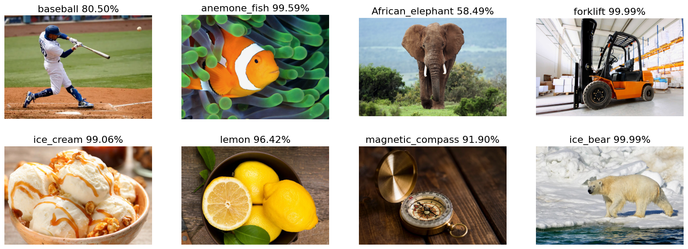

# 2일차

## Pre-Trained Models in Keras
### 준비
```py
import tensorflow as tf
import matplotlib.pyplot as plt
import glob as glob
import os

from zipfile import ZipFile
from urllib.request import urlretrieve
```
+ 이미지 다운로드 하여 unzip
```py
def download_and_unzip(url, save_path):
    print(f"Downloading and extracting assests....", end="")

    # Downloading zip file using urllib package.
    urlretrieve(url, save_path)

    try:
        # Extracting zip file using the zipfile package.
        with ZipFile(save_path) as z:
            # Extract ZIP file contents in the same directory.
            z.extractall(os.path.split(save_path)[0])

        print("Done")

    except Exception as e:
        print("\nInvalid file.", e)

URL = r"https://www.dropbox.com/s/8srx6xdjt9me3do/TF-Keras-Bootcamp-NB07-assets.zip?dl=1"

asset_zip_path = os.path.join(os.getcwd(), "TF-Keras-Bootcamp-NB07-assets.zip")

# Download if assest ZIP does not exists.
if not os.path.exists(asset_zip_path):
    download_and_unzip(URL, asset_zip_path)

# Store all the image paths in a list.
image_paths = sorted(glob.glob("images" + os.sep + "*.png"))
```
+ 이미지 표시
```py
plt.figure(figsize=(18, 6))
for idx, image_path in enumerate(image_paths):
    image = plt.imread(image_path)
    plt.subplot(2,4,idx+1)
    plt.imshow(image)
    plt.axis('off')
```
+ 모델 가져오기: [모델 목록](https://www.tensorflow.org/api_docs/python/tf/keras/applications/MobileNet?_gl=1*aauqlt*_up*MQ..*_ga*MTgyMjgxODU2NS4xNzEzMjM5NzIx*_ga_W0YLR4190T*MTcxMzIzOTcyMC4xLjAuMTcxMzIzOTcyMC4wLjAuMA..)
```py
model_vgg16        = tf.keras.applications.vgg16.VGG16()
model_resnet50     = tf.keras.applications.resnet50.ResNet50()
model_inception_v3 = tf.keras.applications.inception_v3.InceptionV3()
```
+ input shape 확인
```py
print(model_vgg16.input_shape)
print(model_resnet50.input_shape)
print(model_inception_v3.input_shape)
# (None, 224, 224, 3)
# (None, 224, 224, 3)
# (None, 299, 299, 3)
```
+ 선택한 모델로 이미지 predict 함수
```py
def process_images(model, image_paths, size, preprocess_input, display_top_k=False, top_k=2):

    plt.figure(figsize=(20,7))
    for idx, image_path in enumerate(image_paths):

        # Read the image using TensorFlow.
        tf_image = tf.io.read_file(image_path)

        # Decode the above `tf_image` from a Bytes string to a numeric Tensor.
        decoded_image = tf.image.decode_image(tf_image)

        # Resize the image to the spatial size required by the model.
        image_resized = tf.image.resize(decoded_image, size)

        # Add a batch dimension to the first axis (required).
        image_batch = tf.expand_dims(image_resized, axis=0)

        # Pre-process the input image.
        image_batch = preprocess_input(image_batch)

        # Forward pass through the model to make predictions.
        preds = model.predict(image_batch)

        # Decode (and rank the top-k) predictions.
        # Returns a list of tuples: (class ID, class description, probability)
        decoded_preds = tf.keras.applications.imagenet_utils.decode_predictions(
            preds=preds,
            top=5
        )

        if display_top_k == True:
            for jdx in range(top_k):
                print("Top {} predicted class:   Pr(Class={:20} [index={:4}]) = {:5.2f}".format(
                    jdx + 1, decoded_preds[0][jdx][1], jdx, decoded_preds[0][jdx][2] * 100))

        plt.subplot(2,4,idx+1)
        plt.imshow(decoded_image)
        plt.axis('off')
        label = decoded_preds[0][0][1]
        score = decoded_preds[0][0][2] * 100
        title = label + ' ' + str('{:.2f}%'.format(score))
        plt.title(title, fontsize=16)
```
### 모델별 인식
+ model_vgg16 모델
```py
model = model_vgg16 # 모델선택
size = (224, 224)   # model_vgg16의 shape의 사이즈

preprocess_input = tf.keras.applications.vgg16.preprocess_input

process_images(model, image_paths, size, preprocess_input)
```

+ model_resnet50 모델
```py
model = model_resnet50
size = (224, 224)   # model_resnet50의 shape의 사이즈

preprocess_input = tf.keras.applications.resnet50.preprocess_input

process_images(model, image_paths, size, preprocess_input)
```


+ model_inception_v3
```py
model = model_inception_v3
size = (299, 299)   # model_inception_v3의 shape의 사이즈

preprocess_input = tf.keras.applications.inception_v3.preprocess_input

process_images(model, image_paths, size, preprocess_input, display_top_k=True)
```


+ MobileNet
```py
model_mobilenet_v2 = tf.keras.applications.mobilenet.MobileNetV2()
model = model_mobilenet_v2
```

## 기타정보
+ Small object detection
    + Pagers with code에 논문에서 발표한 코드가 공개 되어 있음.
+ TensorBoard
+ tqdm
    + 현재 loop의 진행상황을 볼 수 있음.
    ```py
    from tqdm import tqdm
    import time

    for i in tqdm(range(20)):
        time.sleep(0.8)
    ```
